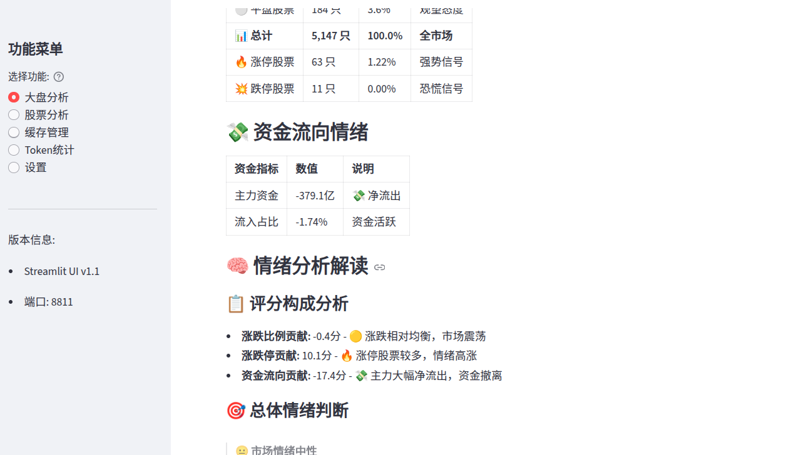
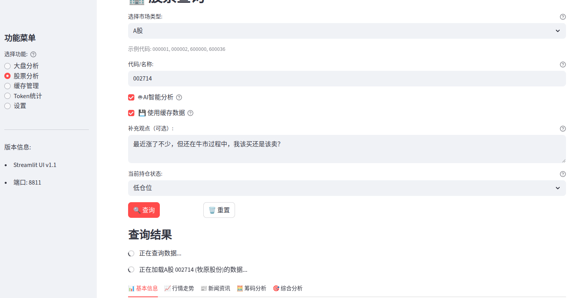
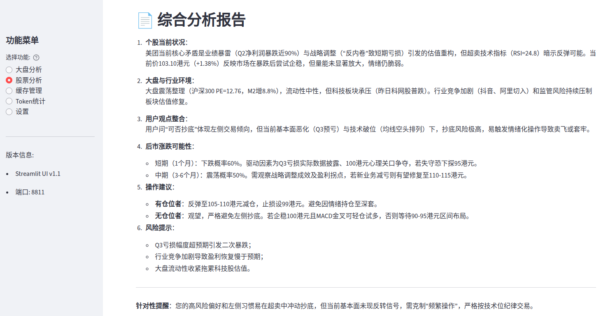
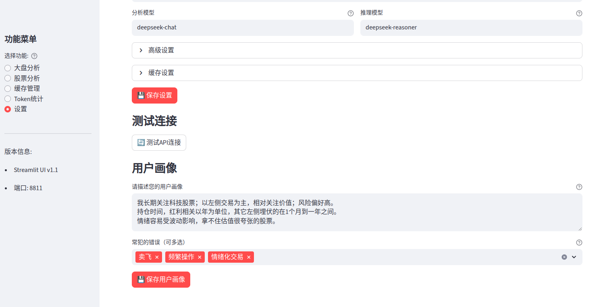
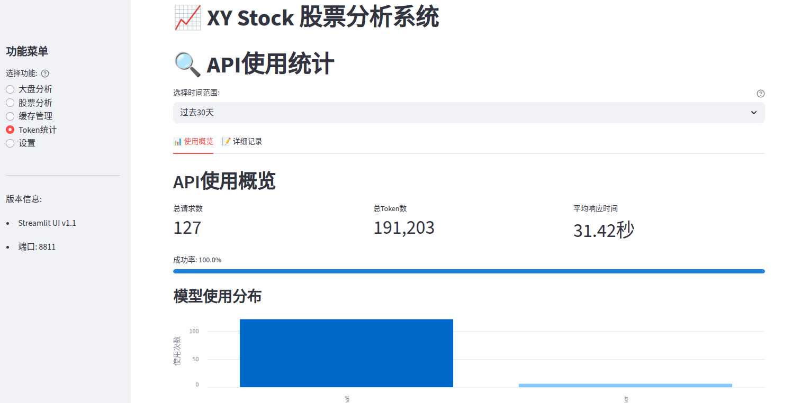

# xystock

一个极简的股票/基金分析工具，支持实时行情获取和大模型分析。

## 版本更新 - v1.2.0 (2025-09-30)

**🎉 重大更新！** 新版本增加了以下主要功能：

- **市场情绪分析** - 全新市场情绪数据获取与分析功能
- **股息分红分析** - 深度分析股票分红历史与收益潜力  
- **ETF持仓分析** - 获取ETF详细持仓数据与投资策略分析
- **风险指标计算** - 新增个股与指数多维度风险评估
- **指数新闻集成** - 实时获取指数新闻并结合数据分析
- **多指数支持** - 支持分析上证、深成、创业板、科创50等主要指数
- **风险偏好设置** --在设置中新增风险偏好选项
- **基本面增强** - 加入盈利、偿债、运营、成长等更多数据支持
- **策略回测模块** - 完整回测框架和可视化工具

本次更新包含 **30+ 次提交**，新增 **5000+ 行代码**，欢迎大家体验新版本！

## 主要功能

本工具支持对A股市场全部股票、ETF基金、港股通股票，以及上证指数、深证成指、创业板指、科创50等主要大盘指数的行情预测与智能分析。无论是个股、基金还是指数，均可一站式获取实时数据、AI分析报告和操作建议。

工具提供了三个主要功能模块：大盘分析、个股分析和策略回测。



在预测个股时，需要以大趋势为前提，尤其是在现阶段，大盘有明显的趋势。因此，我将大盘预测这一部分单独作了界面。另一个启发是，对于难以预测的长期趋势和短期事件，可以通过经济数据和新闻事件实时捕捉，可解决一部分问题。

在大盘分析部分，收集的数据包括：大盘指数（如上证、深成、创业板、科创板等）、技术指标（如移动平均线、MACD、RSI 等）、市场基本面（包括估值、资金流向、融资融券等）、市场新闻和情绪分析。支持导出多种格式的分析报告（Markdown、PDF 等）。



在个股分析部分，收集的数据包括：股票基本信息、行情趋势（含风险分析）、新闻资讯、筹码分析、股息分红信息、ETF持仓数据等。同样支持多格式报告导出。



新增的策略回测模块提供了完整的回测功能，包括：策略分析、交易记录展示、可视化工具，帮助用户验证投资策略的有效性。

在进行最终的 AI 分析时，还考虑了用户相关的因素：支持用户输入自己的观点和关注重点；输入持仓情况，设置用户画像，以及用户常犯的错误。这些用户相关的特征，在一些券商 APP 中，可能是通过数据总结出来的。在没有数据的情况下，让用户自己输入，只要是客观全面，其实效果也差不多，可能还更好。再退一步，可以把券商 APP 中的用户画像直接贴过来。




## 安装和使用

拉取最新代码

```bash
git clone https://github.com/xieyan0811/xystock.git
cd xystock
```

### 方式一：使用预构建镜像（推荐）

**适用场景：** 快速部署、生产环境使用

直接使用 Docker Hub 上的稳定版镜像，无需本地编译：

```bash
docker pull xieyan800811/xystock:latest
```

> 💡 **提示：** 此步骤可选，`docker-compose up` 会自动拉取镜像。后续版本更新时，重新执行 `docker pull` 即可获取最新版本。

### 方式二：本地构建镜像（开发版）

**适用场景：** 二次开发、功能定制、体验最新特性

从源码本地构建 Docker 镜像：

```bash
docker build . -t xieyan800811/xystock:latest
```

### 启动应用

**生产模式（推荐）：**
   
```bash
docker compose up -d
```
   
**开发模式：**

```bash
docker compose -f docker-compose.dev.yml up -d
docker exec -it xystock-web bash
python -m streamlit run ui/app.py --server.address=0.0.0.0 --server.port=8811
```

### 使用指南

1. 打开浏览器访问 `http://localhost:8811`
2. 首次使用需先配置大模型相关参数
3. 建议按以下顺序体验功能：
   - **Token 统计** - 了解模型调用成本
   - **大盘分析** - 获取市场整体趋势
   - **个股分析** - 深入分析具体股票

## 升级说明

在升级到新版本时，请注意以下事项：

- **数据格式变化**：升级可能涉及数据格式变化，建议升级后清理一下缓存数据，以确保数据兼容性
- **Docker 镜像更新**：由于底层库的升级，可能存在旧的 Docker 镜像与新代码不匹配的情况，建议重新下载最新的 `latest` 镜像：
  ```bash
  docker pull xieyan800811/xystock:latest
  ```

如果遇到兼容性问题，可以尝试清除所有缓存并重新构建容器。

## 支持的模型



系统支持所有兼容 OpenAI API 的模型服务，包括但不限于 OpenAI、OpenRouter、阿里百炼、Ollama 等。以下是经过测试和推荐的模型列表：

### OpenAI 模型

| 模型名称 | 模型ID | 推荐用途 |
|---------|--------|---------|
| GPT-4.1-nano | gpt-4.1-nano | 超轻量级模型，适合基础操作 |
| GPT-4.1-mini | gpt-4.1-mini | 紧凑型模型，性能较好 |
| GPT-4o | gpt-4o | 标准模型，功能全面 |
| o4-mini | o4-mini | 专业推理模型（紧凑版） |
| o3-mini | o3-mini | 高级推理模型（轻量级） |
| o3 | o3 | 完整高级推理模型 |
| o1 | o1 | 顶级推理和问题解决模型 |

### 阿里百炼 (DashScope) 模型

| 模型名称 | 模型ID | 推荐用途 |
|---------|--------|---------|
| 通义千问 Turbo | qwen-turbo | 快速响应，适合日常对话 |
| 通义千问 Plus | qwen-plus | 平衡性能和成本 |
| 通义千问 Max | qwen-max | 最强性能 |
| 通义千问 Max 长文本版 | qwen-max-longcontext | 支持超长上下文 |

### DeepSeek v3 模型

| 模型名称 | 模型ID | 推荐用途 |
|---------|--------|---------|
| DeepSeek Chat | deepseek-chat | 通用对话模型，适合股票投资分析 |
| DeepSeek Reasoner | deepseek-reasoner | 推理模型 |

目前我使用的是 deepseek 系列模型，价格便宜且更了解中国情况。目前 deepseek-reasoner 比 deepseek-chat 贵一倍，2025 年 09 月 06后有调整，具体价格与是否缓存有关，不太好统计。计费方法具体见：https://api-docs.deepseek.com/zh-cn/quick_start/pricing/

### 其他兼容服务

系统也支持 OpenRouter、Ollama 等提供兼容 OpenAI 接口的服务。只需在设置中配置相应的 Base URL 和 API Key 即可。

## 模型使用建议

- **普通模型**：对于快速查询和简单任务，建议使用较轻量的模型，如 GPT-4.1-mini、o4-mini 或通义千问 Turbo。
- **推理模型**：建议使用功能更强大的模型，如 GPT-4o、o3 或通义千问 Max，以获取更深入的股票分析。

## 目录结构
- backtesting/ 回测模块及可视化工具
- llm/  大模型相关及prompt
- market/ 市场数据获取和分析
- stock/ 个股数据获取和分析
- ui/   用户界面
- utils/ 工具函数和数据格式化
- data/ 缓存和数据存储

## 使用场景

股票相关的数据和指标我可以通过 APP 或者在财经网站上看到，有些还有“持仓/买入/卖出”的建议。那为什么还需要自己做工具呢？

下面列出了一些需求，而我目前还没找到现成方法：

* 信息并不是获取不到或不充足，而是看不过来，不知道如何解读：比如，如何看 KDJ 指标，布林开口大小背后的逻辑是什么？净利润 xx 在所属行业中算高还是低……
* 数据指标是零散的，没有具体结论。即使有结论，没有推理过程，也不敢相信。需要一个像 DeepSeek 深度思考一样的工具，可以看到推理过程。即使出了问题，至少知道问题出在哪里，而不是玄学、黑盒。
* 网上给出的推荐操作是卖出，但不知道什么时候卖，什么情况下卖。需要具体的建议：如果持有，什么时候卖；如果空仓，什么时候买；做长线、中线还是短线？具体点位是多少？
* 有些信息 API 和大模型可能抓不到，但我想告诉大模型。比如：最近微信群里大家都在议论股票，我需要一个渠道把这些信息输入给模型和其它数据一同分析。
* 需要针对用户定制的建议，考虑到用户的风险偏好、交易方式、容易犯的错误，需要在决策时提醒用户。因为不同的操作风格（左侧/右侧，长线/短线）有时需要完全不同的建议。
* 考虑到人的情绪波动，不仅在股票下跌时会感到焦虑，当盘面剧烈波动时，不确定性会导致焦虑，从而引发非理性操作，也需要从情绪角度提示用户。
* 对于一些意料外的情况，比如某股票突然上涨超过 5%，用户可能会想看一下新闻，分析原因，并需要对突发事件的实时分析和建议。
* 优化那些 " 多数人 " 能够操作的可选项，比如：A 股、ETF 基金、港股通。有些项目可能参考了一些国外开源代码，包含很多美股内容，但我们买不了，即使是港股通也有门槛。与其花时间做得全面，不如重点开发 80%+ 用户都会使用的功能。
* 试用的几个 AI 工具每次分析一支股票耗时约 15-20 分钟，有的不缓存，每次都重新拉取数据并调用 AI 进行从头思考，需要更节省时间和金钱的解决方案。


*如果你觉得项目对你有帮助或能解决你的实际问题，请帮我点亮小星星～*

## 更新日志

查看详细的版本更新历史和功能变化，请参考 [CHANGELOG.md](./CHANGELOG.md)。

## 许可证

本项目采用 MIT 许可证 - 详情请参阅 [LICENSE](./LICENSE) 文件。

MIT 许可证允许您自由地使用、修改、分发本软件，包括商业用途，只需保留原始的版权声明和许可证声明。

---

## 公众号实盘预测说明

为便于大家直观了解实际预测效果，2025 年剩余几个月内，我将在公众号【得之有道】每天发布上证指数次日涨跌的预测结果（受篇幅限制，仅展示上证指数，供参考）。欢迎关注公众号，持续跟踪和验证工具表现。


扫码关注公众号：


